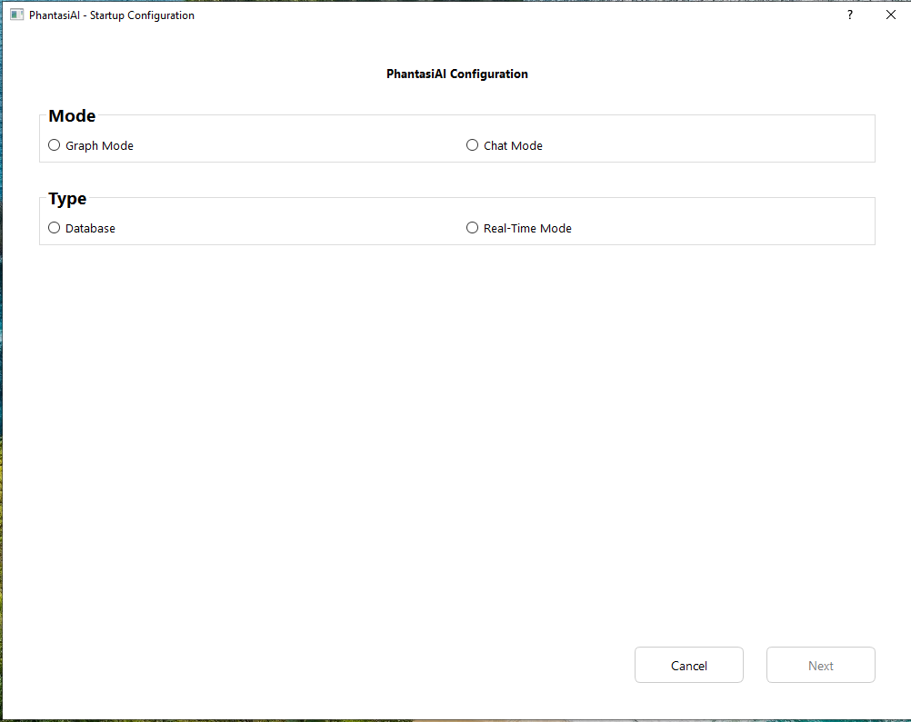
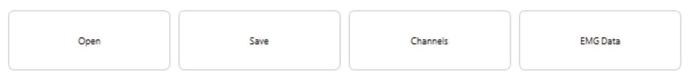
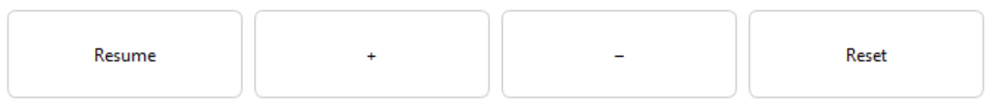
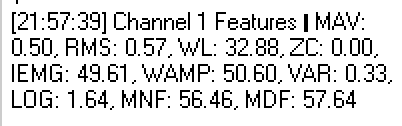
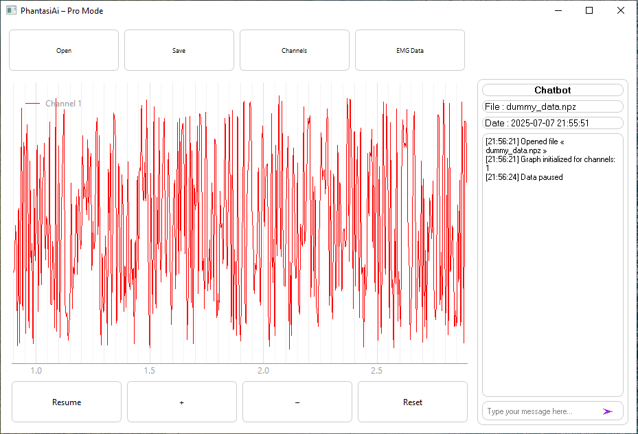
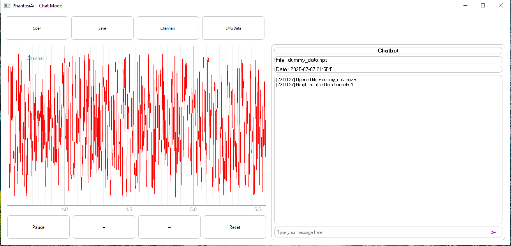
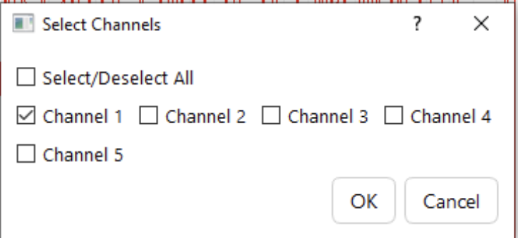

# User Guide

## Table of Contents
- [Introduction](#introduction)
- [Initial configuration](#initial-configuration)
- [Main interface](#main-interface)
  - [Top toolbar](#top-toolbar)
  - [Playback controls](#playback-controls)
  - [Active data information](#active-data-information)
  - [Modes of Operation](#modes-of-operation)
- [Channel Management](#channel-management)

---

## Introduction

TODO : add une description

---

## Initial configuration

**Configuration elements:**

**🔲 Mode**
- **Graph Mode**: Graphical mode for advanced visual analysis
- **Chat Mode**: Conversational mode for simplified interaction

**🔲 Type**
- **Database**: Fetching data from a database file
- **Real-Time Mode**: Real-time data analysis from an arduino

---

## Main interface

### Top toolbar

**🔲 Main buttons:**
- **📁 Open**: Open a .npz data file
- **💾 Save**: Save current logs with the chabot
- **🔧 Channels**: Select the desired channels for analysis
- **📊 EMS Data**: Display EMS Data in the chatbot

### Playback controls

**🔲 Graph controls:**
- **⏸️ Pause / ▶️ Resume**: Playback control
- **⏩ Zoom**: Zoom adjustment
  - **➕ +**: Increase zoom level
  - **➖ -**: Decrease zoom level
- **🔄 Reset**: Reset zoom level

### Active data information

**🔲 Statistics displayed in chat:**
  - **MAV**: Mean Absolute Value
  - **RMS**: Root Mean Square
  - **WL**: Waveform Length
  - **ZC**: Zero Crossings
  - **IEMG**: Integrated EMG
  - **VAR**: Variance
  - **LOG**: Logarithmic
  - **MNF**: Mean Frequency
  - **MDF**: Median Frequency

**🔲 Main visualization area:**
- **📈 Real-time graph**: Multi-channel signal display
- **🎨 Color-coded channels**: Each channel has a unique color for easy identification
- **📏 Time scale**: Horizontal axis

**🔲 Chatbot area:**
- **📄 File information**: 
  - Name of the file
  - Date of creation of the file
- **💬 Message history**: Chronological conversation log with timestamps showing interactions between user and chatbot
- **⌨️ Input area**: Area for user input and communication with the chatbot

### Modes of Operation
**🔲 Two modes available:**
- **Graph Mode**: For detailed graphical analysis of signals

- **Chat Mode**: For simplified interaction with the chatbot

---

## Channel Management

**"Select Channels" window:**
- **✅ Select/Deselect All**: Select/deselect all channels
- **🔲 Channel list**: List of available channels with checkboxes
- **🔘 Multiple selection**: Select multiple channels by checking their boxes

---

